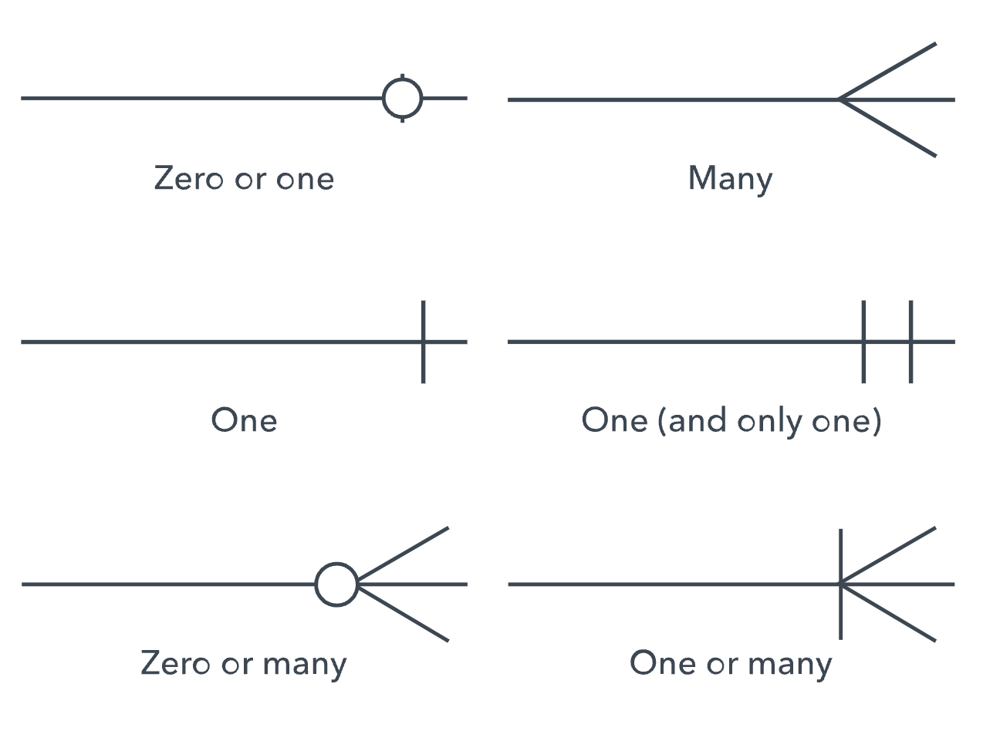
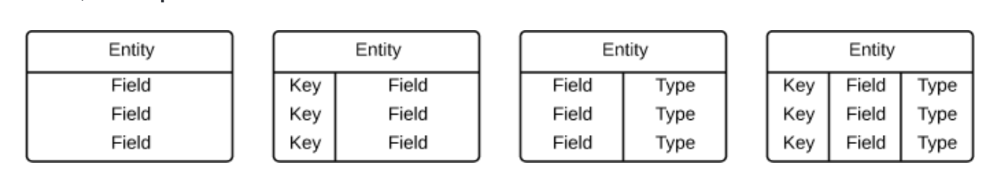
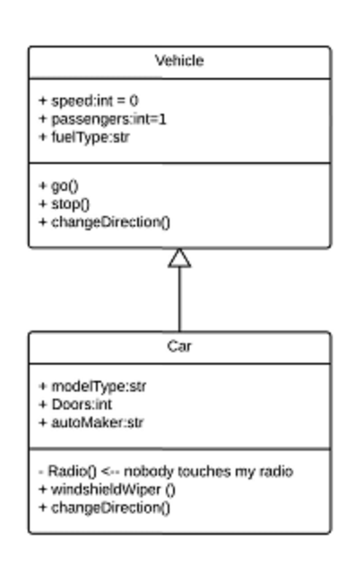
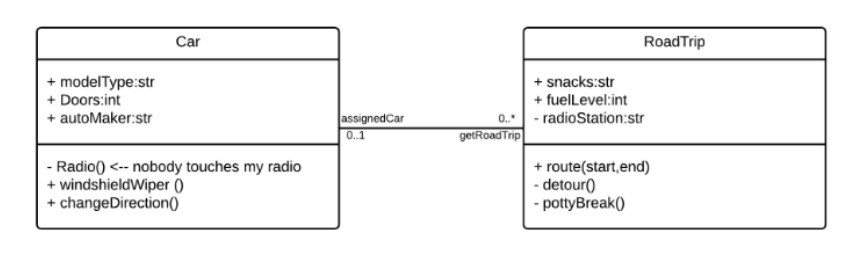
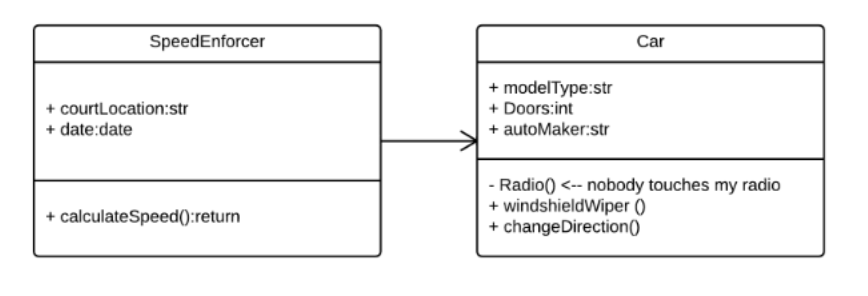
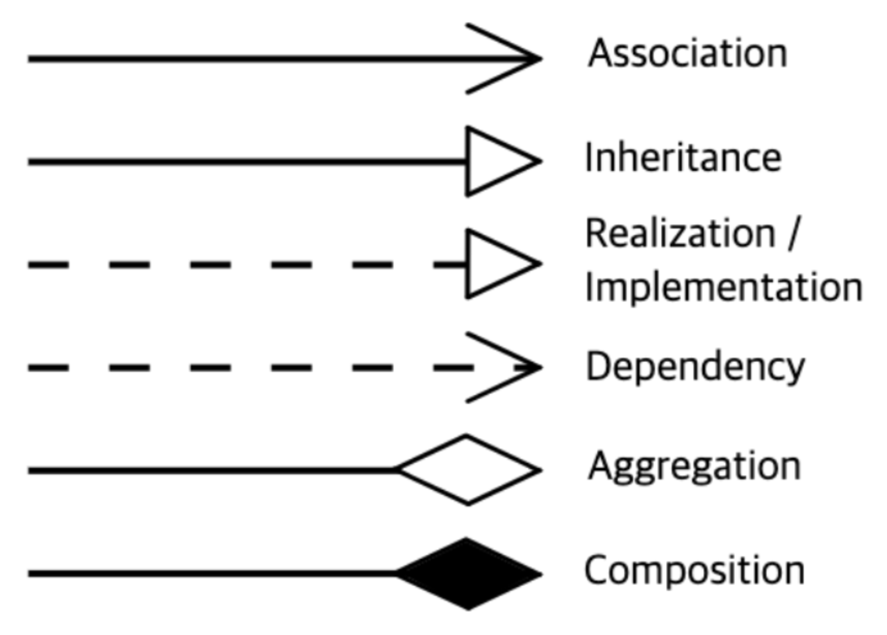
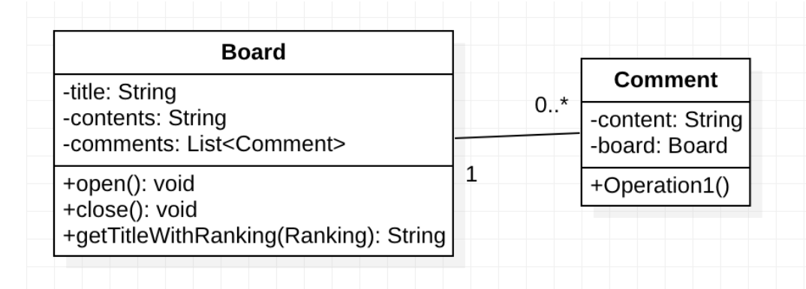
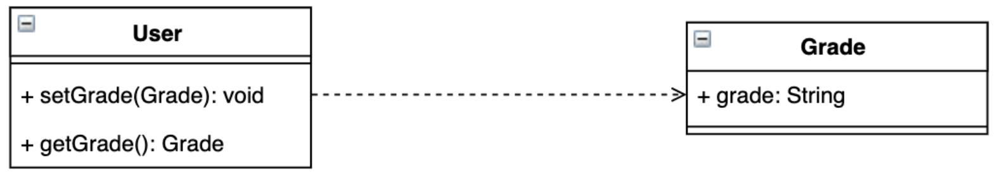

션이 그려주신 새 배송방법 데이터/도메인 모델링을 보고 궁금해서 찾아본 각종 다이어그램들. '토씨하나 안틀리고 정확하게 사용하자!' 보다는 '느낌만 가져가자' 라는 마인드로 보자

## ERD란 무엇인가? 
[What is an ERD](#refs)

Entity 들의 Relation을 나타내는 Diagram 제곧내 수준으로 모든걸 나타내는 이름이라고 보면 된다. 유의할 것은 엔티티간의 관계를 나타내는 다이어그램을 총칭하는 용어라는 점. 세부적으로 다양한 종류가 있는 듯 하다.

주요한 용어만 짚고 넘어가보자.

- Entity: 데이터가 쌓이고 정의할 수 있는 어떤 것. 사람, 객체, 컨셉, 이벤트 등. 명사를 생각해보자. diagram에선 사각형으로 그린다.
- Entitiy keys: 엔티티를 유니크하게 정의할 수 있는 attribute. 
    - Super key: 엔티티를 유니크하게 정의할 수 있는 하나 혹은 그 이상의 attribute들의 set.
    - Candidate key: minimal super key. 엔티티를 구별할 수 있는 최소 단위의 키. candidate key가 여러개 모인 set이 super key 인듯.
    - Primary key: 데이터베이스 디자이너가 엔티티 셋을 유니크하게 indentify 할 때 사용하겠다고 정한 candidate key
    - Foreign key: 엔티티간의 관계를 identify 하는 키.
- Relationship: how entities act upon each other or are associated with each other. diagram에선 마름모로 그린다.
- Attribute: 엔티티의 프로퍼티
- Cardinality: 엔티티간의 수량 관계를 나타내는 attribute 

상술 했듯이 ERD는 세부적으로 다양한 형태가 있는 것 같다. 본문에서는 three levels of detail 이 있다고 설명한다.

- Conceptual data model: 가장 고수준의 뷰. 가장 적은 디테일을 담고 있다. 모델의 전반적인 스코프?를 그리며 시스템 아키텍쳐를 묘사한다.
- Logical data modal: conceptual data modal 보다는 자세한 레벨. 더 자세한 operational and transactional 엔티티가 정의된다. 다만 실제로 이를 구현할 기술들과는 독립되어있어야 한다.
- Physical Data model: logical model 을 구현하기위한 기술적인 디테일을 포함한 다이어그램이다.

션이 올려주신 데이터 모델링은 physical data model 이었다! 

결국 '데이터' 모델링 이라는걸 간과한 상태에서 conceptual erd 설명을 보고, 그것과는 다른 무엇이다... 무언가 추상적인 것이다... 라고 생각하고 봐서 혼란스러웠는데 physical data model 수준으로 보면 그냥 데이터베이스 도식화라고 보면 될듯.

## ERD 기호와 표기 
[ERD Symbols and Notation](#refs)

대애애충 erd가 뭔지 감은 잡았고 실제 erd를 이해하기 위해 기호와 표기를 살펴보았다.

우선 conceptual erd의 기호와 표기는 처음 봤던 [ERD 설명](#erd란-무엇인가)에서 확인한 대부분의 symbol들이 다 conceptual erd에 사용되는 거라서 그냥 넘어가도 될 것 같다.

physical ERD symbols도 

entity 그리는 법과 

[Crow Foot ER Diagram templates](https://www.lucidchart.com/pages/templates/erd/lucidchart-erd-crows-foot), cardinality 표기만 이해하면 된다.

## 도메인 모델링과 클래스 다이어그램
[UML Class Diagram tutorials](#refs)

이제 션이 올려주신 이미지 중 첫번째 데이터 모델링은 다 이해했는데, 두번쨰 도메인 모델링은 뭘까?

도메인 모델링은 UML의 클래스 다이어그램을 그리신 것 같다. 

클래스 다이어그램은 classes, attributes, operations and rel ationships를 그려서 시스템 구조를 모델링하는 다이어그램이다. 

#### 클래스
클래스 다이어그램에서 클래스는 세 섹션으로 구성된다.
- upper section: 클래스의 이름. 항상 필요하다. classifier 이든 object 이든 (?)
- middle section: 클래스의 attributes를 나타낸다. 클래스의 특정 instance를 나타낼때에만 쓰인다.
- bottom section: 클래스의 operations(methods)를 나타낸다. 리스트 포맷으로 보여지고, 각 operation마다 한줄을 차지한다

=> 션이 올려준거에 middle, bottom이 없는것도 있고, middle에 attribute랑 method가 같이 있는데, 그럼 bottom은 왜 따로 분리해뒀는지 물어보자.

#### 접근제어자
접근제어자는 각각 다음과같이 매핑되어있다.

- public: +
- private: -
- protected: #
- package: ~
- derived: /
- static: (underlined)

#### 멤버 스코프
classifier 와 instances 두 멤버 스코프가 있다고 하는데 무슨소린지 모르겠다.

#### 기타 추가적인 diagram copmonents

- classes: uml 에서 클래스는 객체 혹은 공통의 구조와 행동을 공유하는 객체의 집합을 나타낸다? 걍 클래스인 것 같다. 인스턴스를 따로 나타내는 경우도 있나? 모르겠다. 클래스는 사각형 세개로 이루어지는데, 첫줄은 이름 ( 필수 ), 두번째 줄은 attributes ( 옵셔널 ), 세번째 줄은 methods ( 옵셔얼 ) 이렇게 구성된다.
- signals: 단방향 비동기 커뮤니케이션을 나타내는 기호이다.
- data types: 데이터 값을 정의하는 classifier ? 
- package: 연관된 classifiers를 조직하기 위한 shape. large tabbed rectangle로 나타낸다고 한다.
- interface: cohesive 한 행동들의 set을 정의하는 operation signature와 attribute definition의 집합. interface를 구현하는 하나이상의 class를 가져야한다.
- enumerations: user-defined data types. includes groups of identifiers
- objects: instacne of class...? 얘는 어디쓰지? concrete or prototypical instances 를 나타낼때 쓴단다.
- artifacts: 시스템의 concrete entity를 나타낼때 쓰는 모델 엘리먼트? document, database 등등? 뭐지

#### interactions

- inheritance: 닫힌 화살표와 실선으로 표현된다. (implementation도 이걸로 나타내는지? )

- bidirectional association: 두 클래스간의 기본적인 관계. 서로를 인지하고 있다. 두 클래스간의 실선으로 나타낸다. cardinality와 뭔가 다른 표시도 있는데... 뭐 나중에 보자. 느낌만 가져가자. 에시는 Car(1):RoadTrip(N)의 관계

- unidirectional assoiciation: 한 클래스만 다른 클래스를 인지하고 있는 관계. 인지하고 있는 클래스에서 인지되는 클래스로 향하는 열린 화살표의 실선이 그려진다.

## 클래스 다이어그램 좀 더 보기

- interface나 abstract 같은 요소들은 `<<>>`(길러멧)을 사용해서 나타낼 수 있다.
- 클래스간의 관계는 다음과 같이 다양하게 나타낼 수 있다.

    - inheritance, implementation은 뭐 아는 그대로임
    - association: 다른 객체의 참조를 가지고 있는 경우를 나타냄. 실선으로 나타내고 방향성이 있을 경우 열린 화살표로 표시함 
    - dependency: 메소드 내에서 대상 클래스의 객체를 생성하거나 사용, 리턴받아 사용하는 것. 멤버 변수로 계속 유지되는 관계가 아니라 특정 메소드를 호출할떄 파라미터로 받거나 리턴할때에 일시적으로 사용하는 형태를 말하는 듯. 점선과 닫힌 화살표
    - aggregation과 composition은 뭔가 어려운 것 같음. aggregation은 ddd 책에서 언뜻 본것같은 용언데 책 보면서 한번 더 살펴보자

#### refs

- [What is an ERD](https://www.lucidchart.com/pages/er-diagrams)
- [ERD Symbols and Notation](https://www.lucidchart.com/pages/ER-diagram-symbols-and-meaning)
- [UML Class Diagram Tutorial](https://www.lucidchart.com/pages/uml-class-diagram)
- [How represents multiple similar foreign keys in ERD database diagram](https://stackoverflow.com/questions/9200789/how-represent-multiple-similar-foreign-keys-in-erd-database-diagram)
- [클래스 다이어그램](https://sabarada.tistory.com/72)
- [클래스 다이어그램](https://brownbears.tistory.com/577)
